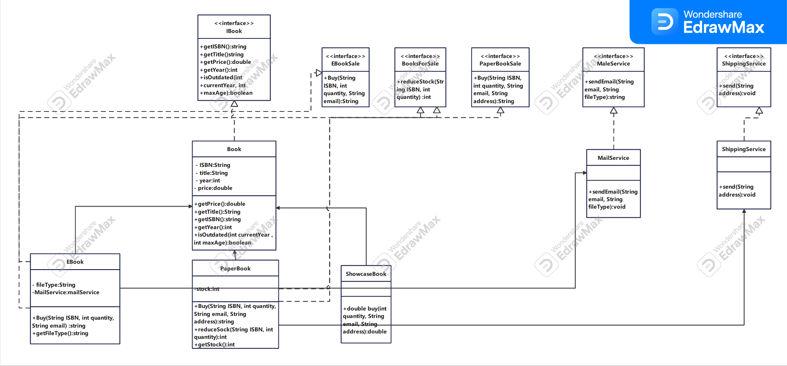
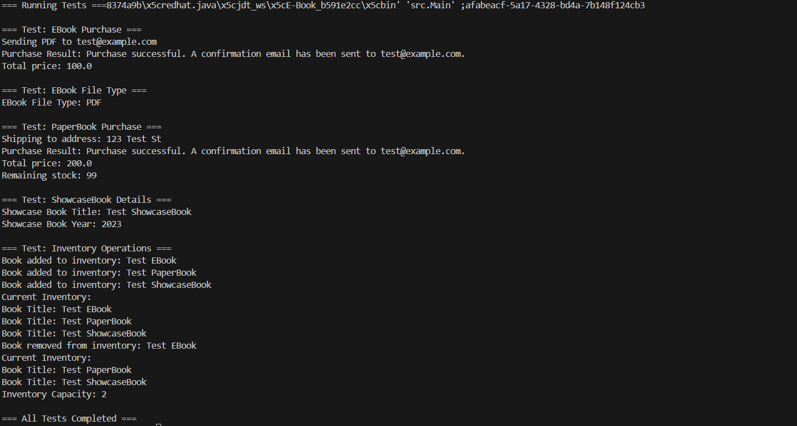

# Online Bookstore System

This is a small Java project to simulate an online bookstore system. It includes multiple book types (eBook, paperBook, showcaseBook) and lets you manage inventory and purchase flow. It also follows OOP design principles to keep the system extensible.

## Features

- Add books to inventory with ISBN, title, price, and year.
- Supports:
    - eBooks (sent via email).
    - Paper books (shipped and have stock).
    - Showcase books (not for sale).
- Buy books by ISBN, quantity, email, and address:
    - Validates inputs.
    - Reduces stock for paperBooks.
    - Triggers mail or shipping (simulated).
- Remove outdated books from inventory.

## Test Coverage

Tests are in `EBookTests.java` and include:

- eBook purchase.
- PaperBook purchase and stock reduction.
- Invalid purchase attempts.
- ShowcaseBook display.
- Inventory management (add/remove).
- File type check for eBooks.

## How to Run

1. Compile the project:
     ```bash
     javac -d out src/**/*.java
     ```

2. Run the tests:
     ```bash
     java -cp out src.tests.EBookTests
     ```

3. Test output:
     ```
     === Test: EBook Purchase ===
     Sending PDF to test@example.com
     Purchase Result: Purchase successful. A confirmation email has been sent to test@example.com.
     Total price: 100.0

     === Test: EBook File Type ===
     EBook File Type: PDF

     === Test: PaperBook Purchase ===
     Shipping to address: 123 Test St
     Purchase Result: Purchase successful. A confirmation email has been sent to test@example.com.
     Total price: 200.0
     Remaining stock: 99

     === Test: ShowcaseBook Details ===
     Showcase Book Title: Test ShowcaseBook
     Showcase Book Year: 2023

     === Test: Inventory Operations ===
     Book added to inventory: Test EBook
     Book added to inventory: Test PaperBook
     Book added to inventory: Test ShowcaseBook
     Current Inventory:
     Book Title: Test EBook
     Book Title: Test PaperBook
     Book Title: Test ShowcaseBook
     Book removed from inventory: Test EBook
     Current Inventory:
     Book Title: Test PaperBook
     Book Title: Test ShowcaseBook
     Inventory Capacity: 2

     === All Tests Completed ===
     ```

4. Class Diagram  
     

5. Screenshots  
     
